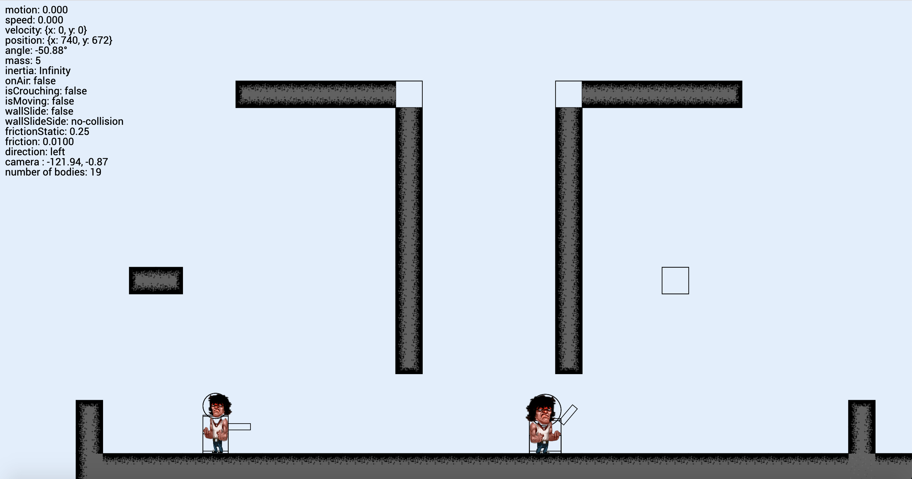

# Run&Gun

> Mario was cool but he had no gun.

__[RunAndGun](https://d0rianb.github.io/RunAndGun/) is a quick plateformer/2D shooter game.__

The project can be run with `webpack` installed by the command `npm run dev`.

The game is in an early development state and look like this :

A demo is available at this [url](https://d0rianb.github.io/RunAndGun/).

#### Credits
The game use Matter.js Physics Engine to run the world physics.
